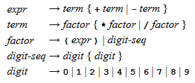

# GUICalculator

This is a simple GUI calculator developed in Java. It utilizes [Java Swing Framework](https://en.wikipedia.org/wiki/Swing_(Java)) for the GUI, and [recursive-descent parsing](https://en.wikipedia.org/wiki/Recursive_descent_parser) for calculations.

## How to use it:

Download the package above, and run it using either the command line or an IDE. If you don't want to download the entire package or don't have an IDE, you can download the executable jar file here. You can run the jar file with the command line or by double clicking on the file.

Once you have it running, you can enter any expression you'd like! The calculator will prevent you from entering expressions that are not consisted with the CFG shown below, but you'll need to be careful with divide by 0. The calculator will correctly evaluate the expression you enter following the correct [order of operations](https://en.wikipedia.org/wiki/Order_of_operations).

## How it works:

The recursive-descent parsing this calculator utilizes relies on the following CFG ([Context-Free Grammar](https://en.wikipedia.org/wiki/Context-free_grammar)):



*This is a CFG used for CSE 2231 at OSU. It is not my intellectual property.*

Based on this CFG, the following expressions are valid inputs for the calculator:
```
3+4
3+(5*4)
9/(5-2)
(6)
```

And the following are invalid inputs:
```
5(4+7)
4+(3-6
-3+6
```
The first is invalid because there must be an operator preceding every parenthesis. The second is invalid because all opening parentheses must have a closing parenthesis. The last is invalid because (-) is an operator, and cannot be used to represent negative integers. According to this CFG, (-) must be preceded and followed by numbers.

***Buttons disable and enable as the user enters expressions in order to force input that is consistent with the CFG. The only possible error that can be thrown by this GUI calculator is a divide by 0 error, because that is found while parsing.***
